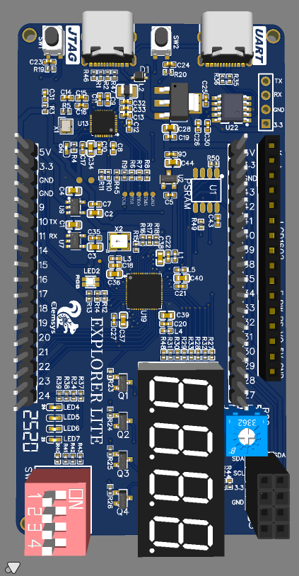
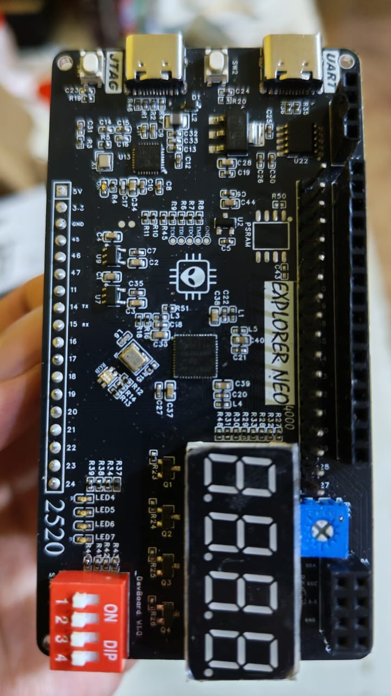
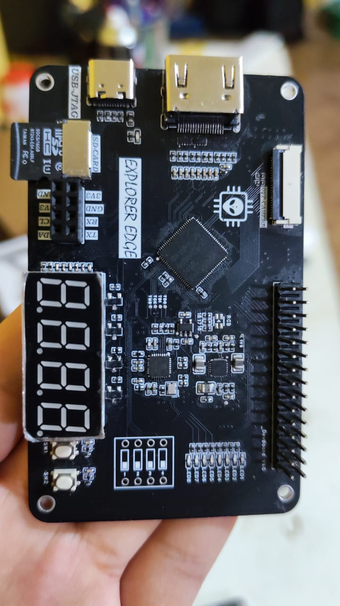

# 🛸 FPGAeduDesign  
### *Soluciones Profesionales en FPGA & Plataforma Educativa en Diseño Digital*

&nbsp;&nbsp;

&nbsp;&nbsp;

&nbsp;&nbsp;

---

## ⚡ Áreas Clave

<strong>Desarrollo FPGA</strong>

<strong>Sistemas en Tiempo Real</strong>

<strong>Formación Profesional</strong>

<strong>Ingeniería de Hardware</strong>

---

## 🔌 Explorer Series – Placas de Desarrollo FPGA

&nbsp;&nbsp;

&nbsp;&nbsp;

 

<strong>Explorer Lite-1K</strong> &nbsp;&nbsp;•&nbsp;&nbsp; <strong>Explorer Neo-5K</strong> &nbsp;&nbsp;• &nbsp;&nbsp;<strong>Explorer Edge-9K</strong>

📁 Los ejemplos, proyectos y pruebas para cada placa se encuentran en el repositorio:  
👉 **[`development_boards/`](https://github.com/FPGAeduDesign/development_boards)**

---

## 🧠 Soluciones y Servicios

- ⚡ Desarrollo de sistemas FPGA de **baja latencia**
- 🎥 Procesamiento de **video e imágenes en tiempo real**
- 📡 Diseño de sistemas DSP, control digital e interfaces de alta velocidad
- 🧩 Co-diseño **MCU + FPGA / SoC**
- 🔌 Diseño de **PCBs**, esquemáticos y sistemas embebidos
- 🎓 Formación técnica en **diseño digital y arquitectura FPGA**
- 🧪 Prototipado, validación y soporte técnico

---

## 🛠️ Tecnologías

**HDL:** VHDL • Verilog • SystemVerilog  
**Herramientas:** Gowin EDA • Vivado • Quartus  
**Open Source:** GHDL • Verilator • Yosys • GTKWave  
**PCB:** KiCad • Altium  

---

## 📬 Contacto

<strong>“¿Te animas a diseñar tu propio chip a medida?”</strong> 🛸

